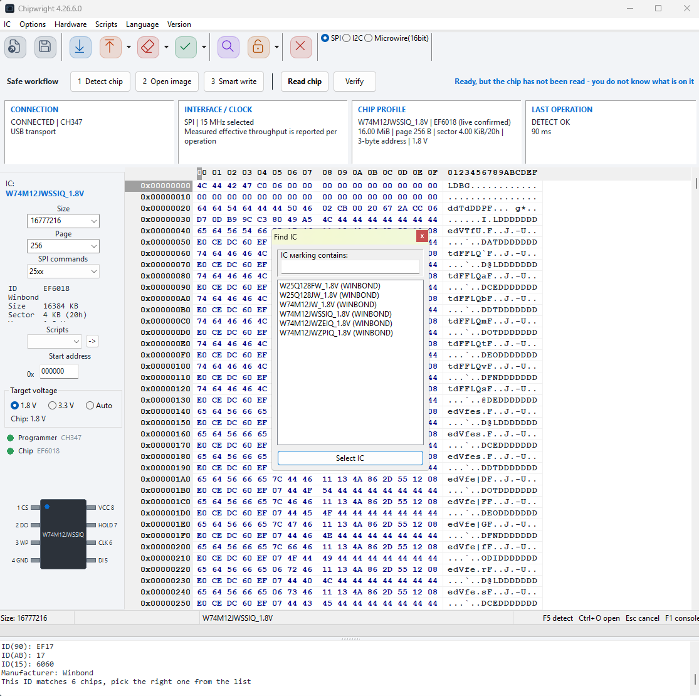
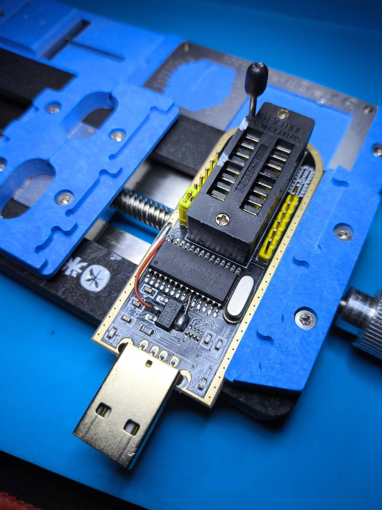
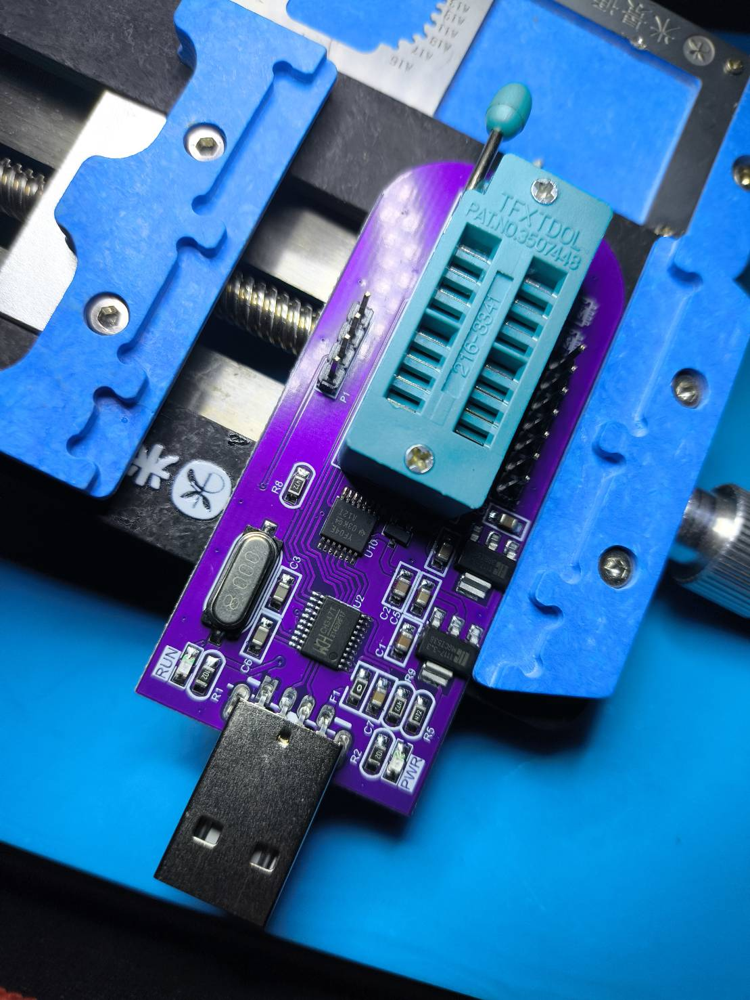

<div align="center">

# Chipwright

**A flash programmer that refuses to guess your chip's voltage.**

SPI NOR · SPI NAND · I²C EEPROM · Microwire — across nine programmers.

[](https://github.com/patnawa/Chipwright/releases)
[](https://github.com/patnawa/Chipwright/actions/workflows/build.yml)
[](CHANGELOG.md)
[](#building)
[](https://www.lazarus-ide.org/)
[](LICENSE)

</div>

---

<div align="center">

<br>
<sub>A Winbond <code>W74M12JWSSIQ</code> identified live as <code>EF6018</code> — 16 MiB, 1.8 V — with the target rail already matched to it.</sub>
</div>

<br>

<table>
<tr>
<td width="46%"></td>
<td>

**The hardware is why this program is careful.**

That is a CH341A in a repair jig — and it has a **red wire soldered across it**. That mod exists because these boards are widely reported to drive **5 V logic on the SPI lines while VCC reads 3.3 V**. Two boards that look identical can behave completely differently, and no software can see the difference.

So Chipwright does not claim to know things it cannot measure. It reports the rail it *asked for* and the rail it *measured* as separate facts, and where the hardware has no sensor it says **"not measurable on this programmer"** instead of showing a number that reads like a confirmation.

Nothing here is inferred upward. A chip whose voltage cannot be established is asked about, not guessed at.

</td>
</tr>
</table>

---

## What it does

<table>
<tr><td width="34%"><b>🔌 Nine programmers</b></td><td>CH347 · CH341A · FT232H · EZP2023+ · AVRISP mkII · USBasp · Arduino · Bus Pirate · serprog</td></tr>
<tr><td><b>💾 Five chip families</b></td><td>25-series SPI NOR · SPI NAND · 24-series I²C EEPROM · 93-series Microwire · 45/95-series</td></tr>
<tr><td><b>⚡ Voltage safety</b></td><td>Four-tier voltage resolution, fail-low on every unknown, 1.8 V/3.3 V rail switching, and an electrical preflight that stops the bus <i>before</i> the first clock edge</td></tr>
<tr><td><b>📊 Honest reporting</b></td><td>Requested vs measured voltage as separate fields; "not measurable" and "unknown" are answers, never blanks or zeros</td></tr>
<tr><td><b>🎚️ Auto tune clock</b></td><td>Finds the fastest clock your wiring actually carries, by repetition rather than guesswork</td></tr>
<tr><td><b>🔒 Read-only safe mode</b></td><td>A latch on the protocol layer that removes the ability to erase, write, unlock or edit a status register</td></tr>
<tr><td><b>🛟 Data safety</b></td><td>Trusted backup with a SHA-256 manifest, connection-stability gate, Smart Write plan preview, byte-by-byte verify, and a second verify in a fresh session</td></tr>
<tr><td><b>🤖 Machine interface</b></td><td>Versioned JSON output and 14 distinct exit codes, so a script never has to parse a log line</td></tr>
<tr><td><b>🏭 Production mode</b></td><td>HMAC-authenticated jobs, canonical chip profiles, durable signed evidence, and anti-replay state</td></tr>
<tr><td><b>🔬 Diagnostics</b></td><td>Chip doctor, true-capacity/counterfeit test, surface scan, SFDP decode, and a connection doctor</td></tr>
<tr><td><b>🧪 Lab Tools</b></td><td>I²C bus scanner, SPI console and UART terminal — kept in their own menu, out of the way of the flash programmer</td></tr>
</table>

Every rule above lives in a hardware-free core unit and is covered by the test suite — **25 suites, no hardware required**. See [`docs/testing.md`](docs/testing.md).

---

## Why this exists

Sending **3.3 V to a 1.8 V flash chip destroys it permanently**. Sending too little only means the chip doesn't answer, and you try again.

Those two outcomes are not equally bad — so Chipwright never treats them as if they were. Every path that cannot work out a chip's supply voltage **fails low**, and when it genuinely doesn't know, it stops and asks you to check the datasheet rather than quietly picking one.

That sounds obvious. It wasn't happening: the chip catalogue carries a voltage field on only **5 of its 658 entries**, and every voltage decision in the program read that field directly. Auto-voltage never worked, and the guard meant to stop a pinned 3.3 V rail reaching a 1.8 V part *could never fire.* Chipwright fixes that.

## Supported programmers

| Programmer | SPI | I²C | Microwire | Notes |
|---|:---:|:---:|:---:|---|
| **CH347** (T / F) | ✓ | ✓ | — | **target voltage 1.8 V / 3.3 V** |
| **CH341A** | ✓ | ✓ | ✓ | the classic black/green dongle |
| **FT232H** | ✓ | ✓ | ✓ | |
| **EZP2023+** | ✓ | — | — | native whole-chip read / write / erase |
| **AVRISP mkII** | ✓ | ✓ | ✓ | |
| **USBasp** | ✓ | ✓ | ✓ | |
| **Arduino** | ✓ | ✓ | ✓ | |
| **Bus Pirate** | ✓ | ✓ | — | open-drain, external supply |
| **serprog** | ✓ | — | — | flashrom serial protocol |

**Chip families:** 25-series SPI NOR · SPI NAND · 24-series I²C EEPROM · 93-series Microwire · 45/95-series.

## CH347 target voltage

The **CH347 II V2.13** board is the only one of the nine with a switchable target rail. It's driven from **GPIO6** — low = 3.3 V, high = 1.8 V. That pin assignment is not documented by WCH; it was recovered from the vendor binary's `CH347GPIO_Set` call sites and then confirmed against real hardware.

**GPIO4** is the board's green activity LED, and Chipwright has to drive it: the board does not. That was established the hard way — the code was once removed on the assumption that bus traffic lit the lamp by itself, and the lamp simply went dark. Sampling GPIO4 across 400 SPI transfers showed it never moving, so there is no drive circuit to defer to. The two pins are written with separate one-bit masks, so switching the rail can never disturb the LED or the reverse.

> **Options → SPI → CH347 target voltage** — `1.8 V` · `3.3 V` · `Auto`

The same switch sits directly on the main window whenever a CH347 is selected: a **Target voltage** box with the three radio buttons and a `Chip:` line showing the selected part's supply voltage — the same front-screen control the board vendor's own software has. The box and the menu mirror each other, and either applies immediately while the device is open.

The board powers up at 1.8 V and Chipwright applies 1.8 V when it starts, so a rail left high by a previous session can never greet the next chip you seat. Within a session the level you pick stays put — it is not wound back between operations, or picking 3.3 V would never survive the read you picked it for.

### How a chip's voltage is worked out

| | Source | Example |
|:--:|---|---|
| 1 | the catalogue's `vcc=` attribute | rare, but authoritative |
| 2 | the `_1.8V` / `_3.3V` name suffix | `W74M12JW_1.8V` |
| 3 | model names that encode the voltage | `MX25U…` / `MX66U…` → 1.8 V |
| 4 | known all-1.8 V JEDEC id prefixes | `W25Q64FW` → `EF6017` |

Tier 4 covers the dangerous group: parts like `W25Q64FW` and `MT25QU256` that are 1.8 V but whose *names say nothing*. The nineteen prefixes — `EF50` `EF60` `EF80` `EF8A` `EF8E` `EF5B` `C860` `C863` `C867` `2041` `2050` `2044` `20BB` `2C5B` `9D70` `9D12` `E060` `1C38` `BA00` — were audited against **all 1,751 entries of the four shipped chip tables**, and `tools/validate_chiplist.py` re-proves the claim on every build, so a future catalogue import cannot quietly poison it.

`C225` is deliberately absent. Macronix used that id prefix for the 1.8 V MX25U family *and* for 3 V parts (`MX25L1635E`, `MX25L3239E`, `MX25L6439E`) *and* for wide-range MX25V — an id that cannot prove a voltage. That is why MX25U is recognised by **name** in tier 3 instead: the names never collide even where the ids do.

**Tiers 3 and 4 may only ever conclude 1.8 V.** Nothing is ever inferred *up* to 3.3 V, because that is the direction that kills chips.

If none of the three resolves, Chipwright asks:

```
The catalog does not state the supply voltage for W25Q64.

Open the chip datasheet and pick its supply voltage. Nothing is
guessed for you here on purpose: sending 3.3 V to a 1.8 V part
destroys it permanently, while too low a rail only means the chip
does not answer and you can try again.

          [ 1.8 V ]    [ 3.3 V ]    [ Decide later ]
```

Your answer is pinned into the voltage menu, so the level in use stays visible instead of hiding in a variable.

### Requested is not measured

Opening a programmer prints what was commanded and what was observed as separate facts:

```
Requested voltage:         1.8 V
Measured voltage:          not measurable on this programmer
Target current:            not measurable on this programmer
Current limit enabled:     not measurable on this programmer
External voltage detected: not measurable on this programmer
Signal (CS/CLK/MOSI):      1.8 V (assumed to follow the rail, not measured)
```

"not measurable" is the answer, not a gap. Showing only the requested level reads as confirmation — a CH347 with a stuck GPIO, a clip on the wrong pad, and a rail loaded down by a motherboard all display an identical "1.8 V". No CH341, CH347 or FT232H has an ADC on the target rail, a sense resistor, a load switch or backfeed detection, so today that is the honest reply for all three. A board with sensing fills the same fields and these lines start carrying real numbers with no other change.

The last line is the one to take seriously. A board that switches VCC to 1.8 V while its logic keeps swinging to 3.3 V passes every other electrical check and destroys 1.8 V parts. Nobody has put a scope on this board's signal pins at both rails, so Chipwright says *assumed* rather than claiming a figure — and [`hardware/test-procedure.md`](hardware/test-procedure.md) is the fifteen minutes that settles it.

Before CS or CLK moves, the same electrical preflight that authenticated production has always used runs under a bench policy. A rail outside the chip's range, or a signal level above what the part tolerates, stops the operation before the first clock edge. Things nobody has characterised produce a note and continue; requiring proof no supported programmer can give would just teach people to switch the gate off.

## Auto tune clock

> **Options → SPI → Частота → Auto tune clock**

Clip leads and long cables do not survive 60 MHz, and the failure reads back as FF — which looks exactly like a blank chip. Picking a number from a menu with no feedback means guessing which side of that line you are on.

So Chipwright finds the line. It starts at the slowest clock, where the wiring cannot be the reason an answer is wrong, and establishes what the chip says about itself. Then it climbs, asking three times per rung. The first rung whose answer changes ends the climb, and it steps down one more for margin.

Three reads, not one, because above the boundary the failures are intermittent — a single read accepts a marginal clock most of the time, which is the worst outcome: fast, plausible, and wrong during the write. The fingerprint is the JEDEC ID **and** a CRC of a real 4 KB read, because a clock that corrupts long transfers but not three-byte ones sails through an ID-only check.

Three outcomes, told apart, because your next move differs: a clock was found; the connection is unstable at the slowest clock (reseat the clip — a slower clock will not help); or nothing answered at any speed (check the rail, pin 1 and seating).

Separately, erase and write read three sample regions — start, middle, end — twice each and compare, before touching a status register. A chip that answers the same question two different ways invalidates the backup that recovery depends on, so this refuses rather than retries, and `--force` deliberately does not bypass it. The refusal names the first differing address.

## Getting started

<table>
<tr>
<td width="42%"></td>
<td>

Any of the nine supported programmers will do. The one above is a WCH board with a ZIF socket — `PWR` and `RUN` on the silkscreen are the power and activity lamps.

Chipwright drives the **CH347** and **CH341A** through WCH's own DLLs, so the same driver package covers both.

Seat the chip with **pin 1 at the lever end** of the socket and close the lever before plugging in.

</td>
</tr>
</table>

1. Install the CH347 driver from **[`drivers/CH347T-Driver/`](drivers/CH347T-Driver)** — the CH341PAR package behind `wch.cn 2.6.2025.4`, confirmed working with this board.
2. Plug the programmer in. Windows should show *USB HighSpeed-SPI/I2C… CH347T* with no warning icon.
3. Download [`Chipwright-<version>.zip`](https://github.com/patnawa/Chipwright/releases) and unpack it. `Chipwright.exe` runs from the folder — no installer.

## Usage

The toolbar across the top is the safe order to work in, left to right.

### Reading a chip

| | Step | What to check |
|:--:|---|---|
| 1 | **Set the target voltage** | `Target voltage` on the left. `Auto` matches the chip once one is selected; otherwise pin it yourself |
| 2 | **Detect chip** | *Chip profile* fills in and the **Chip** lamp turns green |
| 3 | **Read chip** | Bytes appear in the hex view; *Last operation* shows the timing |
| 4 | Save with **Ctrl+S** | |

If detection finds nothing, the log says why — a wrong rail and a loose clip look identical to the chip, and both read back as all `FF`.

### Writing a chip

**Smart write** is the one to use. It reads the chip first, works out the minimum erase and program needed, shows you that plan, and only proceeds once you accept it. Nothing is written before you have seen what it intends to do.

Every write runs through the same chain, in this order:

| | Step | If it fails |
|:--:|---|---|
| 1 | **Chip identity, read now** — not trusted from two minutes ago | An all-`FF` or all-`00` reply is a floating bus, not a chip |
| 2 | **Electrical preflight** against the chip that actually answered | Refused before the first clock edge |
| 3 | **Step order** — rail, chip and preflight all still valid | Refused, naming the first missing step |
| 4 | **Safe mode check** | Refused at the protocol layer — no menu or script can reach past it |
| 5 | **Connection stability** — three regions read twice and compared | Refused, naming the first differing address |
| 6 | **Protection bits** | Refused, or asks, depending on what is locked |
| 7 | **Trusted backup** + `.json` manifest with SHA-256 | Write does not start |
| 8 | **Erase and program** to the previewed plan | |
| 9 | **Byte-by-byte verify** | Reported with the failing address |
| 10 | **Second verify in a fresh USB session** | Write is reported as failed, not warned about |

Step 3 is the one that catches mistakes rather than faults. Change the target rail and chip detection is revoked — a chip that answered at 3.3 V is not evidence of a chip at 1.8 V. Load a different image and the preflight that judged the previous one is revoked. Each destructive run consumes its arming, so the next part in the socket goes through the ladder again.

Step 8 closes and reopens the device before re-reading, which catches driver-cached reads and contact that is marginal until something re-initialises. It is *not* a power-cycle test — no supported programmer can remove target power — and the log says so rather than implying more than it did.

Each backup lands in `backup/` as a `.bin` plus a `.json` recording the chip, JEDEC ID, capacity, programmer, rail, UTC timestamp and SHA-256. A bare `.bin` cannot answer any of those questions at the moment you need them answered.

> [!WARNING]
> Set the target voltage to match your chip **before** erase, write or verify. The board defaults to 1.8 V, so a 3.3 V part simply will not answer until you raise it — that is the safe failure, and it is deliberate.

> [!TIP]
> Working on an unknown part, or a customer's board? Turn on **read-only safe mode** (Options, or `--safe`). It removes the ability to change the chip at the protocol layer, so nothing — no button, no script, no mistake in any of the checks above — can erase, write, unlock or touch a status register.

### Reading the status strip

The four panels under the toolbar answer "why is this not working" without digging in the log:

- **Connection** — which programmer is actually attached
- **Interface / clock** — bus and SPI clock. A clip lead or long cable often cannot hold 60 MHz; a bus that cannot keep up reads back all `FF`, exactly like an empty socket. Rather than guessing, run **Auto tune clock** and let it find the boundary
- **Chip profile** — the selected part and whether its ID has been confirmed
- **Last operation** — result and elapsed time

### Keyboard

`F5` detect · `Ctrl+O` open · `Esc` cancel · `F1` console

### Command line

`ChipwrightCLI.exe` drives the same engine headlessly for scripting and CI. `Chipwright.exe` takes the same switches with the full chip catalogue behind them. Run either with `--help`.

For callers that are not people, `--json` emits one versioned line:

```json
{"schema_version":1,"action":"detect","ok":true,"result":"ok",
 "programmer":"CH347","chip":"W25Q64FW","jedec_id":"EF6017","size":8388608,
 "requested_mv":1800,"measured_mv":null,"target_current_ua":null,
 "external_power_detected":null,"signal_mv":1800,"signal_measured":false}
```

Values the hardware cannot observe are `null`, never `0` — a consumer reading `"measured_mv":0` as a measurement of zero volts would be making exactly the mistake this whole design exists to prevent. `external_power_detected` is three-valued for the same reason: `false` means no external voltage is present, `null` means this programmer cannot see external voltage, and merging those is how a chip gets written while a motherboard backfeeds its rail.

`--preflight` reports the rail and whether a destructive operation would be allowed, without touching the bus.

Exit codes distinguish the cases where your next action differs:

| | | | |
|---|---|---|---|
| `0` ok | `1` failed | `2` usage | `3` no programmer |
| `4` programmer lost | `5` no chip answered | `6` chip mismatch | `7` voltage refused |
| `8` connection unstable | `9` chip locked | `10` file size mismatch | `11` verify failed |
| `12` file error | `13` cancelled | | |

## Lab Tools

> **Lab Tools** — `I2C bus scanner` · `SPI console` · `UART terminal`

Bench instruments, kept in their own menu so the flash programmer's screen stays as simple as its job.

| Tool | What it does |
|---|---|
| **I²C bus scanner** | Probes `0x08`–`0x77` and reports what acknowledges. It never touches the reserved ranges: `0000 xxx` contains the general call address that *every* device on the bus obeys, so a scan that includes it is issuing commands rather than asking questions |
| **SPI console** | Raw command bytes in, hex dump out. A malformed token refuses the whole line rather than being skipped — on a flash chip the difference between `20` and `60` is one sector versus the entire part |
| **UART terminal** | Straight to a COM port, not through the programmer, so it works with anything plugged in |

The SPI console bypasses every guard in the program and says so. The one it cannot bypass is read-only safe mode, because that latch sits on the opcodes rather than on the buttons.

## Hardware

The board is a commercial CH347Ⅱ V2.13, so [`hardware/`](hardware/) is reverse engineering rather than design output — which is exactly why it is written down, because the software refuses operations on the strength of claims about how this board behaves. [`hardware/pinout.md`](hardware/pinout.md) tags every claim with how it was established, and one is still marked UNVERIFIED.

[`vendor-manifest.json`](vendor-manifest.json) records every third-party binary with its SHA-256, licence and origin. Entries marked `unrecorded` have known bytes and an unknown source; no URL has been invented to fill the gap.

## Building

Needs [Lazarus](https://www.lazarus-ide.org/) with FPC 3.2.2 (32-bit).

```sh
powershell -ExecutionPolicy Bypass -File tools\build.ps1     # Windows
./tools/build.sh                                             # Linux
```

Add `-Release` to zip a runnable release folder with the DLLs in place. Tests:

```sh
fpc -Mobjfpc -Sh -Fusoftware -FUtests/lib -otests/unittests.exe tests/unittests.lpr && ./tests/unittests.exe
```

## Changelog

Every release tells its story in **[`CHANGELOG.md`](CHANGELOG.md)** — what was wrong, why it mattered, and what the fix protects. Binaries with checksums are on the [releases page](https://github.com/patnawa/Chipwright/releases); CI rebuilds, re-tests and packages every tagged release from scratch before it is published.

## Credits

Chipwright builds on **[AsProgrammer](https://github.com/nofeletru/UsbAsp-flash)** by nofeletru, via AsProgrammer ProX. The chip catalogue, protocol engines and most backends are their work; this fork adds CH347 voltage control, the activity LED and the voltage-resolution fixes described above.

See [`THIRD_PARTY_NOTICES.md`](THIRD_PARTY_NOTICES.md) for the full list. Released under the [MIT licence](LICENSE).

<div align="center">
<sub>Built for people who would rather read a datasheet than replace a chip.</sub>
</div>
